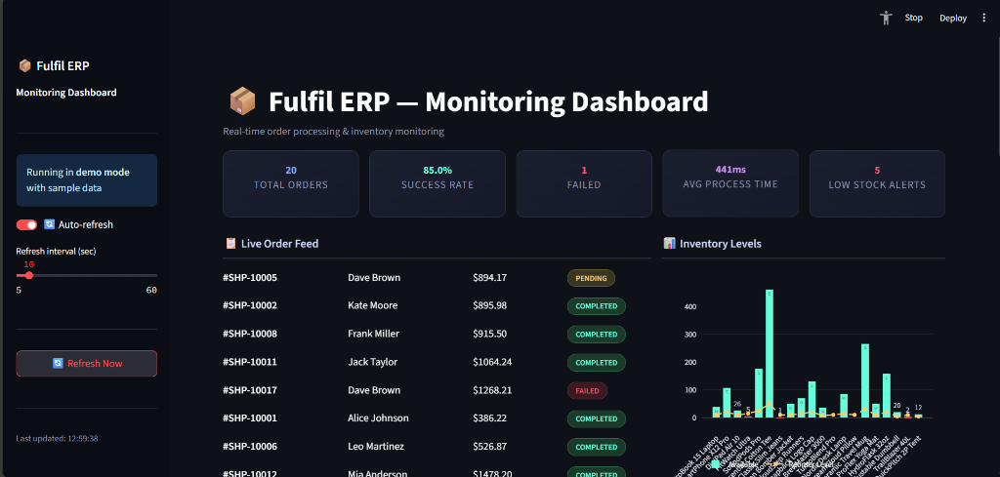
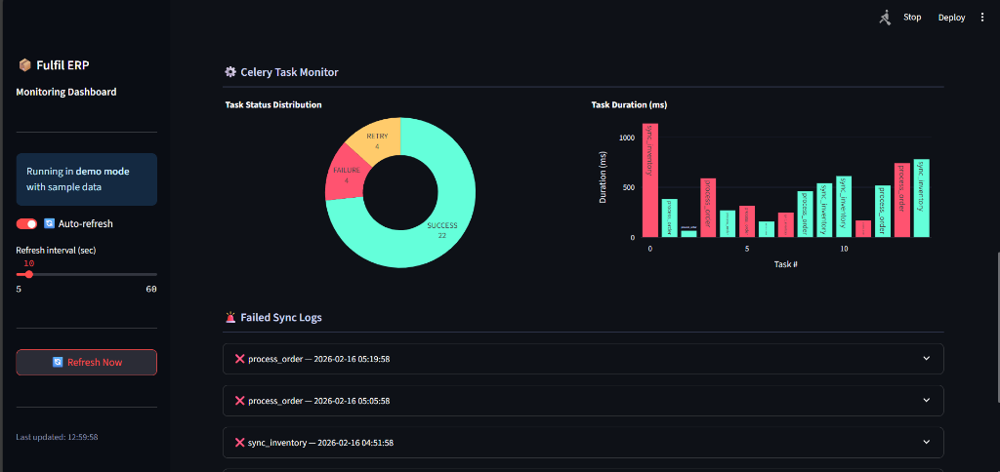
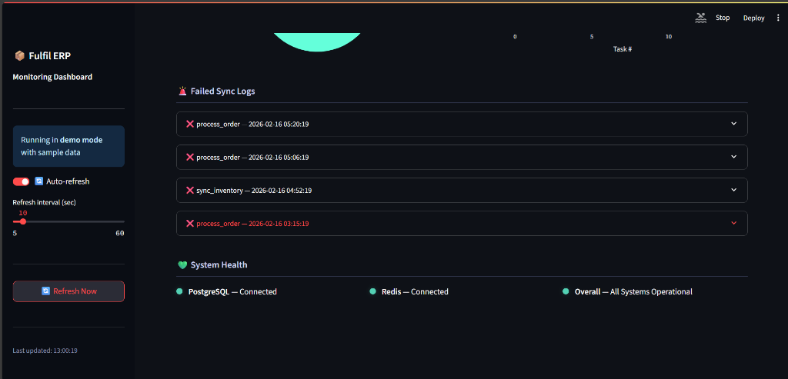

# Fulfil ERP — Order Processing & Inventory Sync

An async order processing pipeline with real-time inventory management and a live monitoring dashboard.

Built with FastAPI, Celery, Redis, PostgreSQL, SQLAlchemy, and Streamlit.

---

## Screenshots

### KPIs & Live Order Feed


### Celery Task Monitor


### Failed Sync Logs & System Health


---

## Key Features

- **Real-time Order Webhook** – Accepts Shopify-style order payloads with built-in duplicate detection
- **Async Processing** – Celery + Redis workers handle orders in the background without blocking the API
- **Inventory Sync** – Automatically deducts stock on fulfillment, flags low-stock and out-of-stock items
- **Retry with Backoff** – Failed tasks retry up to 3 times with exponential delays (60s → 120s → 240s)
- **Full Audit Trail** – Every task execution (success, failure, retry) is logged to `sync_logs`
- **Live Monitoring Dashboard** – Streamlit UI showing KPIs, order feed, inventory charts, task status, and system health
- **Demo Mode** – Run the dashboard standalone with sample data, no database needed

---

## Architecture

```
Shopify Webhook ──► FastAPI ──► Redis (broker) ──► Celery Worker
                      │                                │
                      ▼                                ▼
                  PostgreSQL  ◄─────────────────── Inventory Update
                      │
                      ▼
                  Streamlit Dashboard
```

## Tech Stack

| Layer | Tech |
|-------|------|
| API | FastAPI + Uvicorn |
| Tasks | Celery + Redis |
| Database | PostgreSQL 15, SQLAlchemy 2.0, Alembic |
| Dashboard | Streamlit + Plotly |
| Infra | Docker Compose (6 services) |

## What it Does

- Receives Shopify-format order webhooks with duplicate detection
- Processes orders asynchronously via Celery with row-level inventory locking
- Retries failed tasks with exponential backoff (60s → 120s → 240s)
- Runs periodic inventory scans to flag low/out-of-stock items
- Logs every task result for full audit trail
- Serves a live dashboard with KPIs, charts, and health indicators

## Quick Start

### Demo Mode (no Docker needed)

The dashboard comes with a built-in demo mode that runs with sample data:

```bash
pip install streamlit plotly pandas
streamlit run dashboard/app.py
```

Open **http://localhost:8501** — you'll see a fully populated dashboard with realistic sample data.

### Full Stack (Docker)

```bash
cp .env.example .env
docker compose up --build -d

# seed sample products
docker compose exec api python scripts/seed_data.py

# send test orders
docker compose exec api python scripts/test_orders.py
```

- API docs: http://localhost:8000/docs
- Dashboard: http://localhost:8501

## API Endpoints

| Method | Path | Description |
|--------|------|-------------|
| POST | `/webhooks/shopify/orders` | Receive order webhook |
| GET | `/api/orders` | List orders (paginated) |
| GET | `/api/orders/{id}` | Order detail |
| POST | `/api/orders/{id}/retry` | Retry failed order |
| GET | `/api/products` | Product catalog |
| GET | `/api/inventory` | Stock levels |
| GET | `/api/inventory/alerts` | Low-stock alerts |
| GET | `/api/health` | DB + Redis health |
| GET | `/api/sync-logs` | Task execution logs |
| GET | `/api/metrics` | System metrics |

## Project Layout

```
app/
├── main.py              # FastAPI app
├── config.py            # Pydantic settings
├── schemas.py           # Request/response models
├── celery_app.py        # Celery config + beat schedule
├── logging_config.py    # Structured JSON logging
├── db/
│   ├── base.py          # Engine, session factory
│   └── models.py        # ORM models (5 tables)
├── api/
│   ├── webhooks.py      # Shopify webhook handler
│   ├── orders.py        # Order CRUD + retry
│   ├── products.py      # Product catalog
│   ├── inventory.py     # Inventory queries
│   └── monitoring.py    # Health, metrics, logs
└── tasks/
    ├── order_tasks.py   # process_order (async)
    └── inventory_tasks.py  # sync_inventory (periodic)

dashboard/
└── app.py               # Streamlit monitoring UI

scripts/
├── seed_data.py         # DB seeder (20 products)
└── test_orders.py       # Integration test script
```

## Environment Variables

See [`.env.example`](.env.example) for all available settings.

Key variables: `DATABASE_URL`, `REDIS_URL`, `CELERY_BROKER_URL`, `LOW_STOCK_THRESHOLD`, `DEMO_MODE`.

## License

MIT
